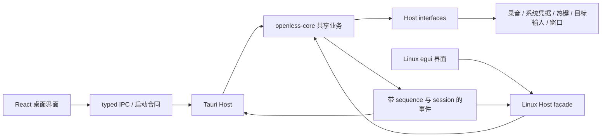

# Core 2.0 架构

状态：canonical；阶段：implementation-backed；更新：2026-09-07；源码基线：`fc38edd1`，应用版本 `2.0.0-Beta.1`，公开合同 `2.0.0`。

## 分层与入口

应用工作目录为 `openless-all/app`。

| 层 | 实现位置 | 职责 |
| --- | --- | --- |
| React | `src/App.tsx`、`src/components/FloatingShell.tsx`、`src/pages/` | 启动显示、页面、草稿、操作与结果反馈 |
| IPC | `src/lib/ipc/shared.ts`、`src/lib/ipc/` | `2.0.0` 启动检查，typed invoke，业务调用前等待 Core 可用 |
| 共享 Core | `crates/openless-core/src/lib.rs`、`api.rs`、`domains.rs` | 公开门面、领域服务、状态机、配置、迁移与会话规则 |
| 原生接口 | `crates/openless-core/src/ports.rs` | 录音、插入、资源、目标上下文、窗口等 Host effect 合同 |
| Tauri Host | `src-tauri/src/commands/`、`core_adapters.rs`、`tauri_coordinator_host.rs`、`tauri_events.rs` | 连接现有 Windows/macOS 原生实现并桥接 React |
| Linux Host/UI | `linux-egui/src/{backend,lib,main}.rs` | 共享 Core 接入、现有 Linux Adapter、egui 页面与事件显示 |
| 合同 | `contract/backend-2.0.json`、`crates/openless-core/tests/`、前端 IPC 测试 | 版本、DTO、事件和领域行为回归 |

## 听写与状态

UI/热键发起 → Core 获取会话及真实目标 → Host 录音与识别 → Core 转写/润色 → Host 向原目标输入 → 真实结果、历史与事件反馈。停止录音、取消会话和正常结束分别调用已有门面，页面导航不接管录音资源。

主窗口与胶囊、问答、选区预览、Agent 等 WebView 共用启动合同检查。布局改进只改变启动说明，不跳过检查。`recordingReady` 由首帧 PCM 证据驱动，不能用定时器伪造就绪。

事件以 `sequence` 去重，以 `sessionId` 归属；Unicode delta 的 offset 是 scalar 数量。QA 全量 messages 校准与 Agent 多轮重放仍遵循各自规则。具体语义的规范来源是 [Linux 事件与会话合同](linux-egui-handoff/06-events-and-sessions.md)及对应代码。

凭据状态、provider descriptor 与有效 pipeline 由 Core 提供。UI 不在渠道 ID 上猜认证规则，不回显已有密钥，不把“已配置”当成设备或网络测试成功。普通写入、已发送粘贴、已复制回退和未知结果分别反馈。

## 平台边界

当前完整支持范围、Linux 交接要求与发布验收统一指向 [2.0 当前范围](2.0-requirements.md)。Linux 有运行与界面起点，但 [缺口登记](linux-egui-handoff/02-gap-register.md)仍存在。React 的 Linux 外观预览不能替代 egui 产品验收。

## 验证入口

`npm test` 会先构建 React，再跑前端与源码合同；其中 `check-hotkey-injection.mjs` 还会运行 Core 的实际快捷键测试。Core 全量验证使用 `cargo test -p openless-core --locked`；Linux 使用 `cargo test -p openless-linux-egui --locked`，原生目标验证遵循 [Linux 验收](linux-egui-handoff/07-acceptance.md)。所列命令不代表已执行；验证结论以当次运行输出为准。
